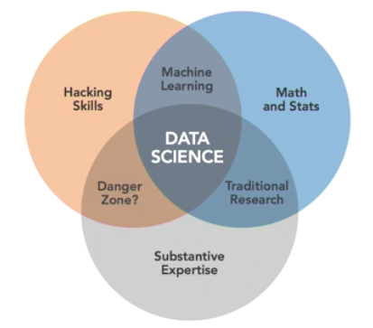

# Course Notes

## Resources
* [Course link](https://www.lynda.com/Big-Data-tutorials/Introduction-Data-Science/420305-2.html)
* [RStudio](https://www.rstudio.com/products/rstudio/download/#download)

## Scratch-pad

```sql
placeholder
```

## What is Data Science?
1. Analysis of diverse data
2. Inclusive analysis

Ability to take unstructured data and find order, meaning, and value.

### The Data Science Venn diagram



1. Computer programming and coding to retrieve and manipulate data
2. Math and statistics to make sense of the data
3. Substantive expertise of the domain (domain knowledge)

Other additional areas:

1. Machine learning
2. Traditional research
3. Danger zone? (rarely happens)

### Pipeline

1. Planning
  1. Define goals
  2. Organize resources
  3. Coordinate people
  4. Schedule project
2. Data preparation
  1. Get data
  2. Clean data
  3. Explore data
  4. Refine data
3. Modelling
  1. Create model
  2. Validate model
  3. Evaluate model
  4. Refine model
4. Follow-up
  1. Present model
  2. Deploy model (server side)
  3. Revisit model (scaling etc)
  4. Archive assets (storage of the project)

## Machine Learning

### Decision Trees

1. Classification trees
2. Regression trees

#### Algorithms
* ID3
* C5.0
* CART
* CHAID
* MARS
* CI

Pros
* Flexible and robust
* Simple to interpret ("white box" model)
* Large data sets

Cons
* Heuristics and local minima
* Overfitting
* Some unworkable concepts (XOR)
* Bias towards more levels

#### Exercise
